.. _2、清单:

2、清单
=======

.. container:: table-wrapper

   ==== ========== ========================================= ==== =========
   编码 名称       描述                                      数量 图片
   ==== ========== ========================================= ==== =========
   1    LED        F5-红发红-短                              10   |image1|
   2    LED        F5-绿发绿-短                              10   |image2|
   3    LED        F5-全彩RGB透明共阴                        1    |image3|
   4    电阻       碳膜色环 1/4W 1% 330R 编带                10   |image4|
   5    电阻       碳膜色环 1/4W 1% 1K 编带                  10   |image5|
   6    电阻       碳膜色环 1/4W 1% 10K 编带                 10   |image6|
   7    点阵       20*20MM 1.9MM 红色 共阳                   1    |image7|
   8    数码管     一位0.56英寸共阴红                        1    |image8|
   9    数码管     四位0.36英寸共阴红 3461AH                 1    |image9|
   10   可调电位器 3296W 10k 103                             1    |image10|
   11   可调电位器 3386MU 103（三针直排）                    1    |image11|
   12   蜂鸣器     有源 12*9.5MM 5V 普通分体 2300Hz          1    |image12|
   13   轻触按键   6\ *6*\ 5MM 插件                          5    |image13|
   14   拨动开关   SS12D00 3MM柄高 三脚/两档                 5    |image14|
   15   传感器元件 LM35DZ                                    1    |image15|
   16   传感器元件 5516 亮电阻5-10KΩ 暗电阻0.2MΩ             3    |image16|
   17   传感器元件 红外接收 5MM 火焰                         1    |image17|
   18   滚珠开关   HDX-2801 两脚一样                         2    |image18|
   19   舵机       SG90 9G 23\ *12.2*\ 29mm 蓝色 辉盛(环保） 1    |image19|
   20   热敏电阻   5MM 103 阻值 10K 绿色 插件                1    |image20|
   21   传感器元件 SW-200D 振动开关                          1    |image21|
   22   陶瓷电容   100NF 104 2.54                            10   |image22|
   23   陶瓷电容   10NF 103 2.54                             10   |image23|
   24   电解电容   100UF 50V 8*12MM 插件                     5    |image24|
   25   面包板     ZY-60 400孔白色（纸卡包装）               1    |image25|
   26   面包线     面包板连接线30根                          1    |image26|
   27   电阻卡     100*70MM                                  1    |image27|
   ==== ========== ========================================= ==== =========

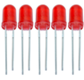
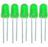
.. |image3| image:: media/edf0ee5faa95d2322ac7202210cbb1bf.jpg
.. |image4| image:: media/f6a8649da4e79abb2f1d15479f073bb5.jpg
.. |image5| image:: media/f6a8649da4e79abb2f1d15479f073bb5.jpg
.. |image6| image:: media/f6a8649da4e79abb2f1d15479f073bb5.jpg
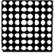
.. |image8| image:: media/7787953ef7619ae3753a3324751ceffc.jpg
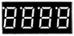
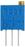
.. |image11| image:: media/6d6025bc96667b6f44070355f2041f13.jpg
.. |image12| image:: media/5a749ec6435e3982bf4dbdc5eaf7b51e.jpg
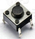
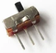
.. |image15| image:: media/c971ffe64d81aea1a195c9b7ae517b24.jpg
.. |image16| image:: media/c09cb519c3304d4c23eb6c479657c4d0.jpg
.. |image17| image:: media/737ba3f73c03fc1a7aac6f07063d06cf.jpg
.. |image18| image:: media/4c38f358a550b7fe0a3710264d51caf2.jpg
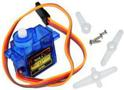

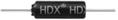
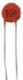
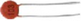
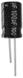
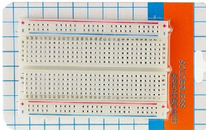
.. |image26| image:: media/aa5f4d54d5b8ec553906f3890bc2df0c.png
.. |image27| image:: media/93852b245f0ae356fac222dadb3dbe24.jpg
