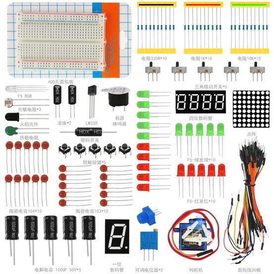

Arduino电子爱好者通用元件包套件503A

# 1、说明

这个套件包含我们玩单片机时使用到的常用元件，如不同阻值的电阻、不同颜色的LED灯、不同容值的电容、传感器、显示器等。有了这款配置好的元件包之后，玩单片机就不需要再去买什么零星的电子物料了。它适用于各种单片机和树莓派。我们还会根据这些元件，提供一些基于Arduino开发板的一些学习课程，包含接线方法，测试代码等，让你对这些电子元件和Arduino开发板有个初步的了解。
